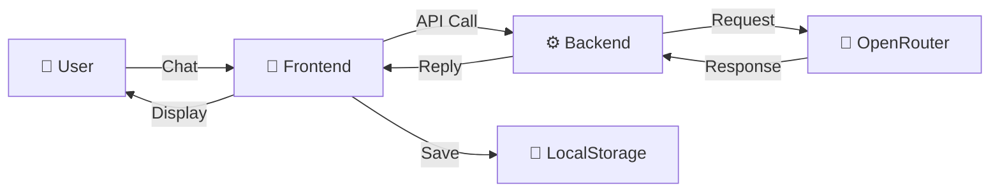

# 💎 Permata AI - AI Chat Application

> ⚠️ **STATUS: BETA** - Aplikasi masih dalam tahap pengembangan. Fitur dapat berubah sewaktu-waktu.

Simple & modern AI chat application built with vanilla JavaScript and Express.js powered by OpenRouter API.

---

## 🎯 Tentang Aplikasi

**Permata AI** adalah aplikasi chat web sederhana yang menggunakan OpenRouter API untuk AI. Bisa chat dengan berbagai model AI, simpan percakapan, export data, dan customize pengalaman Anda.

---

## ✨ Fitur-Fitur Utama

- 💬 Chat real-time dengan AI (GPT-3.5, GPT-4, Llama 2)
- 💾 Auto-save & manual save percakapan
- 📥 Export ke JSON, TXT, atau Markdown
- 🎨 Dark/Light mode
- ⚙️ Customizable model, temperature, max tokens
- 📱 Responsive design (mobile, tablet, desktop)
- ⌨️ Keyboard shortcuts
- 🔍 Search chat history
- 🌙 Theme toggle

---

## 🛠️ Teknologi

**Frontend**: HTML5, CSS3, Vanilla JavaScript, Font Awesome
**Backend**: Node.js, Express.js, Axios
**API**: OpenRouter (GPT-3.5, GPT-4, Llama 2)
**Storage**: Browser LocalStorage

---

## 📦 Requirements

- Node.js v16+
- npm v7+
- Modern browser (Chrome, Firefox, Safari, Edge)
- OpenRouter API Key dari https://openrouter.ai/keys

---

## 🚀 Instalasi & Setup

### 1. Clone & Install
```bash
git clone https://github.com/wilson092/Chatbot.git
cd Chatbot
npm install
```

### 2. Setup API Key (.env)
```bash
# Copy template
cp .env.example .env

# Edit .env dan masukkan API Key dari https://openrouter.ai/keys
OPENROUTER_API_KEY=sk-or-v1-xxxxx
```

### 3. Run Server
```bash
node server.js
```

Buka browser di `http://localhost:3000`

---


---

## 💬 Cara Menggunakan

1. **Chat** - Ketik pesan dan tekan Enter
2. **Save Chat** - Klik tombol Save atau enable auto-save di Settings
3. **Load Chat** - Klik chat di sidebar untuk membuka percakapan lama
4. **Export** - Klik Export untuk download chat sebagai JSON/TXT/MD
5. **Settings** - Customize model, temperature, dan tema di ⚙️ icon
6. **Theme** - Klik Moon/Sun icon di header untuk ganti tema

---

## 📊 System Architecture



---

## 📡 API Documentation

### Backend API Endpoint

#### POST `/ai`

**Description:** Send message ke AI dan dapatkan response

**Request:**
```json
{
    "message": "Apa itu Permata AI?",
    "model": "openai/gpt-3.5-turbo",
    "temperature": 0.7,
    "maxTokens": 2000
}
```

**Response Success (200):**
```json
{
    "success": true,
    "reply": "Permata AI adalah aplikasi chat berbasis web...",
    "model": "openai/gpt-3.5-turbo",
    "tokens": 156
}
```

---

## 📁 File Structure

```
ai-chat/
├── index.html          (Main HTML file)
├── server.js           (Express backend)
├── package.json        (Dependencies)
├── css/
│   └── styles.css      (All styling)
├── js/
│   ├── app.js          (Main logic)
│   ├── api.js          (API calls)
│   ├── ui.js           (Rendering)
│   ├── storage.js      (LocalStorage)
│   └── utils.js        (Helpers)
```

---

## ⌨️ Keyboard Shortcuts

| Shortcut | Action |
|----------|--------|
| `Enter` | Send message |
| `Shift + Enter` | New line dalam pesan |

---

## 💾 Local Storage

Permata AI menyimpan data di localStorage:

```javascript
localStorage['permata_chats'] = [
    {
        id: "chat_1711880400000",
        title: "Diskusi AI",
        timestamp: 1711880400000,
        messages: [...]
    }
]

localStorage['permata_settings'] = {
    model: "openai/gpt-3.5-turbo",
    temperature: 0.7,
    maxTokens: 2000,
    autoSave: true,
    theme: "dark"
}
```

---

## 🐛 Troubleshooting

| Problem | Solution |
|---------|----------|
| Server tidak berjalan | Run `npm install` kemudian `node server.js` |
| API Key error | Cek API Key di `.env` dan regenerate dari https://openrouter.ai/keys |
| Chat tidak tersimpan | Enable "Auto Save" di Settings atau pastikan localStorage aktif |
| Dark mode tidak menyimpan | Clear browser cache dan refresh page |

---

## 📈 Roadmap

Fitur yang ingin ditambahkan di masa depan:
- Voice input/output
- Real-time collaboration
- Chat tagging & search advanced
- Mobile app
- Multi-language support

---


